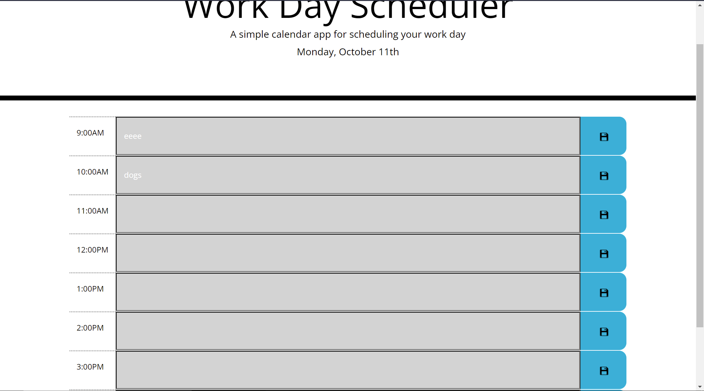

# Daily-Planner

This project is a work day planner and was developed for a homework assignment for Adelaide University fullstack flex bootcamp.

This work day planner utilizes HTML, CSS, Javascript and external sources such as bootstrap, moment.js and jquery to display a working task manager that can be saved using local storage.

This project has been deployed to GitHub Pages. To get this project up and running, you can follow the deployment link. Or, download the sources files to use this as a template.

* [GitHub Repository](https://github.com/JCONSTANT112/Daily-Planner)
* [Deployed GitHub IO](https://jconstant112.github.io/Coding-Assessment-Quiz/)

# Project screenshot

# Prerequisites

To install this application, you will need a text editor. such as Visual Studio Code. 

# Installing

To install this code, download the zip file, or use GitHub's guidelines to clone the repository. Then simply open in preferred browser.

# Summary
* HTML and CSS, Javascript documents along with external sources create a daily work planner that allows you to add and remove tasks to a time slot.
* This project emphasizes the use of using moment.js to adhere to to the requirements of utilizing a time based updating planner based on the actual time of day.
* When a task is on time or past the alloted time the box will change color.

# This project has the following features 
    * A series of time slots boxes that allow for user input.
    * A save button that allows the inputted task to be saved via local storage.
    * Then the user is presented with the task saved in a time slot.
    * Then the task will change from green to red as the allocated time is passed.
    * A user can remove tasks by deleting the input and selecting the save button.
    

# Authors
 Jacob Constantinidis 

# Acknowledgements
Adelaide University full stack flex bootcamp for providing project parameters and guides.